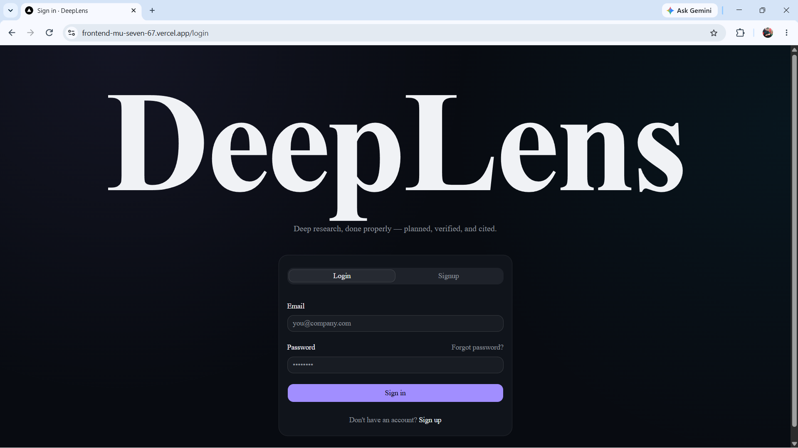
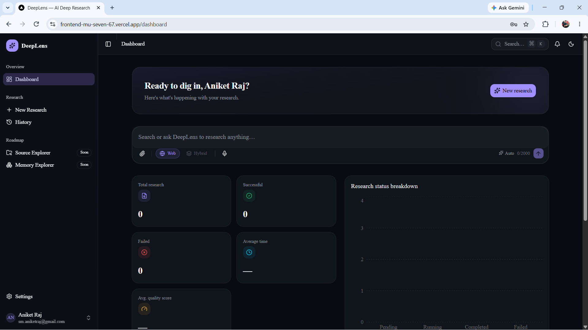
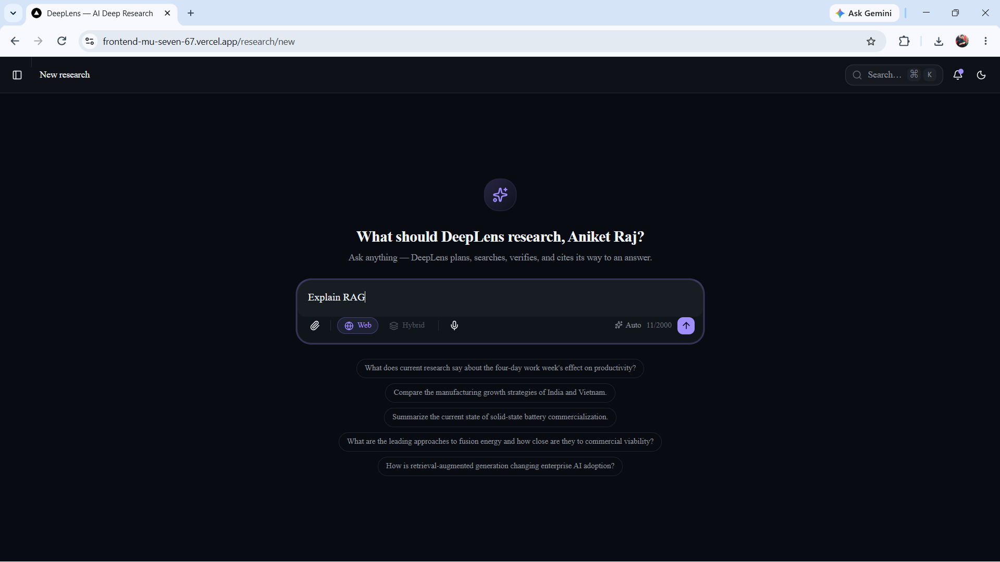
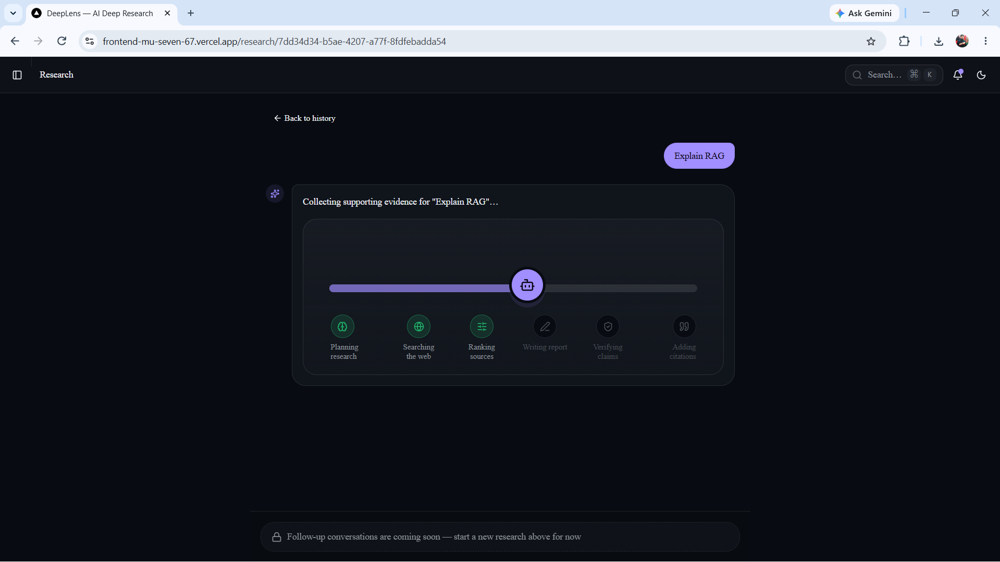
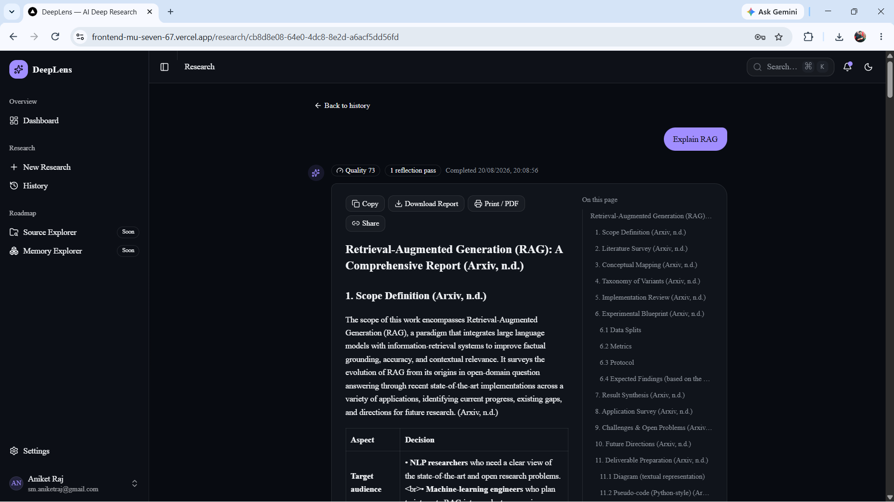
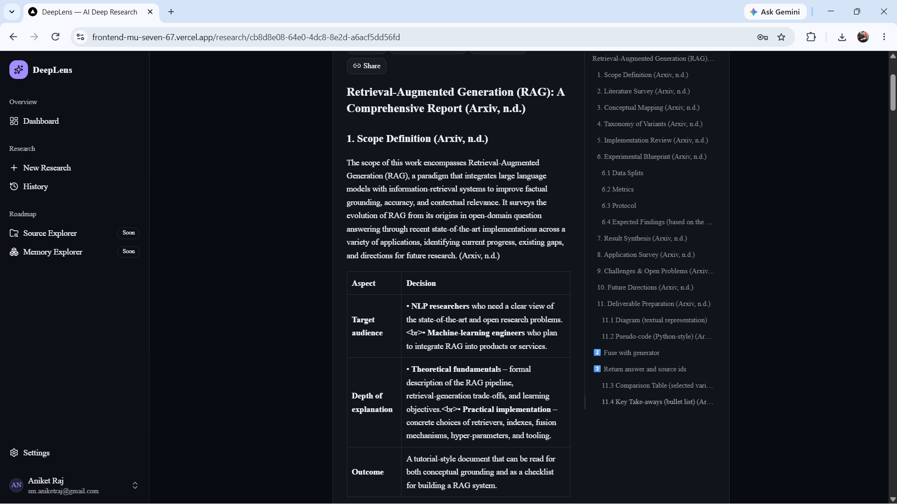

# DeepLens

DeepLens is a deep research platform that turns a plain-language question into a structured, cited report. A query is planned, researched across the live web, verified against its own sources, and rewritten where the evidence is weak — all as a background job the user can watch progress on in real time, not a single blocking LLM call.

---

## Overview

Most "AI search" tools return a single-pass summary. DeepLens instead runs a query through a multi-stage agent pipeline — planning, source discovery, ranking, retrieval, drafting, verification, and citation — with a reflection loop that can send weak sections back through retrieval before the report is considered final. The result is a markdown report with inline citations and a references list, generated end-to-end without a human reviewing intermediate steps.

The system is a full product, not just a pipeline: authenticated accounts, a persisted research history per user, live progress streaming while a job runs, and a long-term memory layer that lets later queries build on prior research.

---

## Features

- **Multi-agent research pipeline** — Planner → Memory Search → Web Search → Source Ranking → Chunking/Retrieval → Writer → Verification → Rewrite → Citation → Reflection, orchestrated as a LangGraph state machine with a bounded reflection loop.
- **Multi-provider LLM layer with automatic failover** — Groq → Mistral → Ollama → Gemini, with per-provider timeouts, health/cooldown tracking, and structured logging of every failover decision.
- **Background job execution** — research runs on a Redis-backed queue (RQ), never on the request thread; the API returns immediately and the frontend polls for live progress.
- **Long-term memory** — a ChromaDB-backed store lets the pipeline check for relevant prior research before searching the web again.
- **Full authentication** — JWT access tokens with rotating, single-use refresh tokens; email verification; password reset; rate-limited auth endpoints.
- **Live progress experience** — an animated milestone tracker reflects the pipeline's actual current stage, driven by real backend state rather than a simulated timer.
- **Research history** — searchable, per-user history with report viewing and markdown export.
- **Analytics dashboard** — real usage stats (total/successful/failed runs, average duration, quality score) and a status-breakdown chart.
- **Responsive, theme-aware UI** — light/dark/system theming, keyboard-driven command palette, and a fully responsive layout from mobile to desktop.

---

## Architecture

DeepLens is a layered, provider-abstracted system:

```
API layer (FastAPI routers)
        │
Service layer (enqueues a job, returns immediately)
        │
Job layer (RQ worker)
        │
Workflow layer (LangGraph StateGraph, with a conditional reflection loop)
        │
Agent layer (prompt + LLM call, one per pipeline stage)
        │
Provider layer (pluggable LLM / search backends)
        │
Domain modules (source ranking & retrieval, citations, evidence scoring, memory, rewrite)
```

Two database engines are used deliberately: an async engine backs the read-facing history/detail API endpoints, while a sync engine backs the still-synchronous research pipeline and its worker process. The frontend never talks to the pipeline directly — it creates a research run over REST and polls for status, since the backend has no push/streaming channel yet.

---

## Tech Stack

**Backend**
- Python, FastAPI
- LangGraph, LangChain-core
- Pydantic v2 / pydantic-settings
- SQLAlchemy 2.0 + Alembic, MySQL
- Redis + RQ (job queue)
- ChromaDB (long-term memory) + sentence-transformers (embeddings)
- Tavily (web search)
- Groq, Gemini, Mistral, Ollama (LLM providers)
- pytest / pytest-asyncio, ruff, black

**Frontend**
- Next.js 15 (App Router), React 19, TypeScript
- TanStack Query (server state) + Zustand (client/auth state)
- shadcn/ui on Base UI, Tailwind CSS
- Framer Motion (animation), Recharts (analytics)
- react-markdown, remark-gfm, remark-math, rehype-katex, highlight.js (curated language set)

---

## Folder Structure

```
DeepLens/
├── backend/
│   └── app/
│       ├── agents/           # planner, search, source_ranker, writer, reflection, ...
│       ├── providers/
│       │   ├── llm/          # groq, gemini, mistral, ollama + manager/registry/health
│       │   └── search/       # tavily provider + manager
│       ├── workflows/        # LangGraph state, nodes, compiled graph
│       ├── prompts/          # per-agent prompt templates
│       ├── citations/        # extraction, injection, reference management
│       ├── intelligence/     # evidence scoring / quality verification
│       ├── memory/           # ChromaDB store + embedding provider
│       ├── search/           # chunking, ranking, retrieval
│       ├── db/                # SQLAlchemy models, sessions, repositories
│       ├── queue/            # Redis connection + RQ queue
│       ├── jobs/             # the function the RQ worker executes
│       ├── api/               # FastAPI routers
│       └── core/              # config, security, logging, exceptions
│   └── tests/                 # pytest suite
├── frontend/
│   ├── app/
│   │   ├── (auth)/            # login, register, password reset, email verification
│   │   └── (app)/             # dashboard, research, history, settings
│   ├── components/            # auth, dashboard, research, layout, ui
│   ├── hooks/                 # TanStack Query hooks per resource
│   ├── services/              # typed API client wrappers
│   ├── stores/                 # Zustand stores
│   └── lib/                    # validation schemas, formatting, shared helpers
├── docker/                    # local MySQL + Redis compose file
└── docs/                      # architecture/design documentation
```

---

## Installation

Clone the repository:

```bash
git clone https://github.com/iamankoo/DeepLens.git
cd DeepLens
```

**Backend**

```bash
cd backend
pip install -r requirements.txt
```

**Frontend**

```bash
cd frontend
npm install
```

---

## Environment Setup

Both the backend and frontend ship a `.env.example` — copy each to `.env` (backend) and `.env.local` (frontend) and fill in real values. Never commit the real files.

```bash
cp backend/.env.example backend/.env
cp frontend/.env.example frontend/.env.local
```

Key variables (see `backend/.env.example` for the full list):

| Category | Variables |
|---|---|
| Search | `TAVILY_API_KEY` |
| LLM Providers | `GROQ_API_KEY`, `GEMINI_API_KEY`, `MISTRAL_API_KEY`, `OLLAMA_BASE_URL` |
| Database | `DATABASE_URL` |
| Redis | `REDIS_URL` |
| Security | `SECRET_KEY`, `ACCESS_TOKEN_EXPIRE_MINUTES`, `REFRESH_TOKEN_EXPIRE_DAYS` |
| Frontend | `NEXT_PUBLIC_API_URL` |

---

## Running the Project

Start local infrastructure (MySQL + Redis):

```bash
docker compose -f docker/docker-compose.yml up -d
```

Apply database migrations:

```bash
cd backend
alembic upgrade head
```

Start the API:

```bash
uvicorn app.main:app --reload
```

Start the background worker (required for research jobs to actually run):

```bash
python -m app.worker
```

Start the frontend:

```bash
cd frontend
npm run dev
```

The app is now available at `http://localhost:3000`, with the API at `http://127.0.0.1:8000` (interactive docs at `/docs`).

---

## Configuration

- **LLM fallback order** is fixed at `Groq → Mistral → Ollama → Gemini`; a provider is skipped only while in cooldown from a recent failure, never reordered by preference.
- **Provider health** is tracked centrally (Redis-backed) so cooldowns are consistent across the API and worker processes, visible at `GET /api/v1/health/providers`.
- **CORS** origins are configured via `CORS_ORIGINS` (comma-separated).
- Full configuration reference lives in `backend/app/core/config.py`.

---

## Usage

1. Create an account or sign in.
2. From the dashboard or the New Research page, submit a question.
3. Watch the live progress view as the pipeline plans, searches, ranks sources, drafts, and verifies the report.
4. Read the finished report with inline citations, or download it from the History page.

---

## Screenshots

| | |
|---|---|
|  |  |
|  |  |
|  |  |

---

## Roadmap

- Document upload and retrieval-augmented research over user-supplied files
- Source Explorer and Memory Explorer (browsing what the system has learned)
- Real-time progress streaming (replacing polling)
- Follow-up questions within an existing research thread
- PDF export
- Admin dashboard (role-based access control already scaffolded)

---

## Contributing

Issues and pull requests are welcome. Please open an issue describing the change before submitting a large PR, and keep changes scoped and tested.

---

## License

MIT License.
